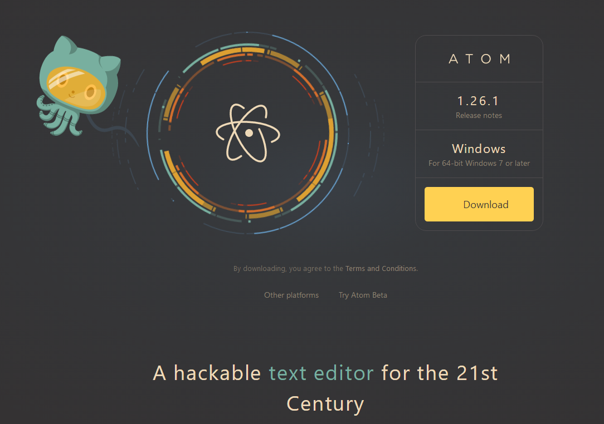

<!-- TOC depthFrom:1 depthTo:6 withLinks:1 updateOnSave:1 orderedList:0 -->

- [Atom教程](#atom教程)
	- [优缺点](#优缺点)
- [Atom常用插件](#atom常用插件)
- [Atom常用插件](#atom常用插件)
- [Atom常用快捷键](#atom常用快捷键)
- [快捷键](#快捷键)
- [目录树操作](#目录树操作)
- [折叠](#折叠)
- [Markdown 写作](#markdown-写作)
- [Markdown 语法补全](#markdown-语法补全)
- [参考文章](#参考文章)
- [总结](#总结)

<!-- /TOC -->
# Atom教程

这个仓库存放我常用的Atom插件，以及Atom配置，还包括Atom的一波使用技巧。

Atom 是github专门为程序员推出的一个跨平台文本编辑器。具有简洁和直观的图形用户界面，并有很多有趣的特点：支持CSS，HTML，JavaScript等网页编程语言。它支持宏，自动完成分屏功能，集成了文件管理器。



2015年1月8日宣布开源。

## 优缺点

优点：

* 小清新界面让人耳目一新.颜控必备
* 丰富的插件几乎能够满足所有 web 开发需求
* git 原生支持
* 简单的插件编写
* 自定义界面[如右图可以更改展示和背景,ui 等等]

缺点：

* 打开大文件卡死，性能低于Sublime
* svn 支持较差

---

# Atom常用插件

* simplified-chinese-menu
  - https://atom.io/packages/simplified-chinese-menu
* **markdown-image-paste-delete**(必备)
  - <https://atom.io/packages/markdown-image-paste-delete>
* markdown-toc
  - <https://atom.io/packages/markdown-toc>
* markdown-writer
  - <https://atom.io/packages/markdown-writer>
* git-plus
  - <https://atom.io/packages/git-plus>
* git-control
  - <https://atom.io/packages/git-control>
* markdown-scroll-sync
  - <https://atom.io/packages/markdown-scroll-sync>


---

# Atom常用插件

1. UI主题

      atom-material-ui ，笔者使用的ui

      atom-material-syntax，和上面配套

      seti-syntax，亮点在文件的 icons

2. 代码美化

      file-icons，显示文件类型对应的图标

      atom-beautify，支持大多数语言的代码格式化

      activate-power-mode，这个叼，不过慎用

      pigments，颜色提示

      minimap，代码预览图

3. 提升效率

      autocomplete-paths，补全路径，有用！

      atom-ternjs，补全 JS

      autocomplete-python，Python补全

      emmet，超有名的前端工具

      docblockr，代码注释，可惜不支持Python

      vim-mode，官方出品，在 Atom 上使用 Vim，哈哈哈

      platformio-ide-terminal，Atom 中集成终端，使用太顺畅了

      markdown-writer，markdown工具，便利


---

# Atom常用快捷键

Atom 专门有个模块列出所有的快捷键

```
# 快捷键
Ctrl + /                启用注释
Ctrl + \                展示隐藏目录树
Ctrl + Alt + I          打开Chrome调试器
Ctrl + [                向右缩进
Ctrl + ]                向左缩进
Shift + Home            选定光标至行首
Shift + End             选定光标至行尾
Ctrl + D                匹配选定下一个
Alt + F3                匹配选定所有
Ctrl + up               选中行上移
Ctrl + down             选中行下移
​
# 目录树操作
a   添加文件
d   将当前文件另存为
i   显示(隐藏)版本控制忽略的文件
​
# 折叠
Alt + Ctrl + [          折叠
Alt + Ctrl + ]          展开
Alt + Ctrl + Shift + {  折叠全部
Alt + Ctrl + Shift + }  展开全部
​
# Markdown 写作
Ctrl + Shift + M        Markdown预览
​
# Markdown 语法补全
b, legal, img, l, i, code, t, table
```


---

# 参考文章
  [Atom教程 w3cschool](https://www.w3cschool.cn/atom)

---
# 总结

* 改改插件，捣鼓捣鼓好写笔记~
* 常记录是个贼好的习惯
